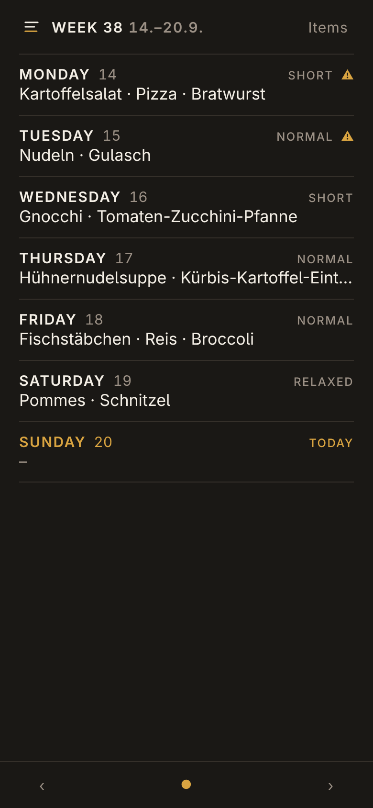
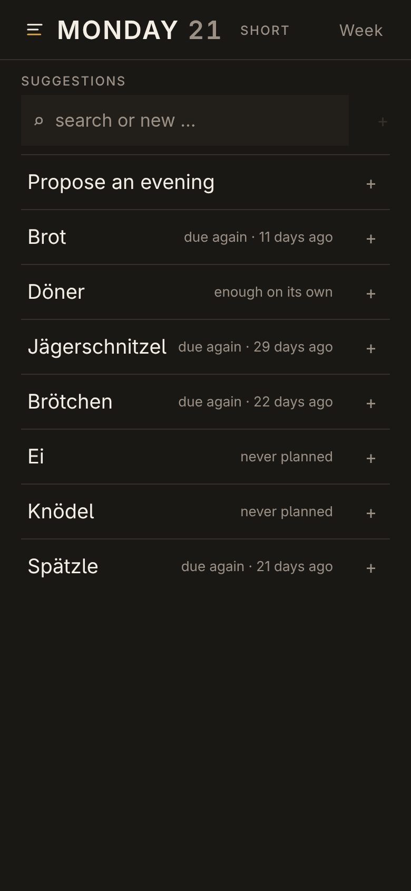
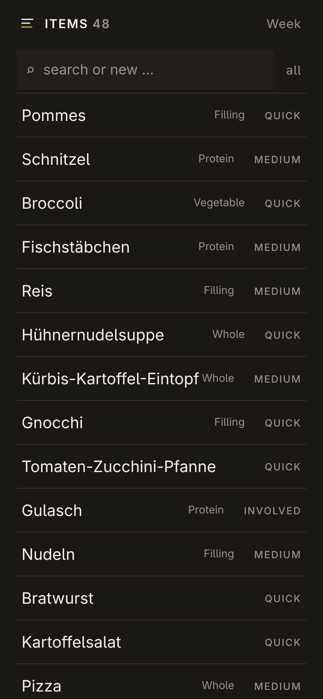

# Table Six

Weekly meal planning for a household. **An evening is a set of items, not a
dish** — potatoes, broccoli and bratwurst is one meal for everyone at the
table, and whoever does not want an item leaves it out. **The app suggests, it
never decides:** every slot is overwritable, every warning is a hint.

The screens side by side: <https://nogo.github.io/table-six/>

<p>
  
  
  
</p>

Three screens, in English or German — one language per deployment:

- **Week** — seven evenings on one phone screen, no scrolling. Plate, effort
  level, and a `⚠` when an evening asks for more time than the weekday has.
- **Day** — one evening fills the screen. One tap adds an item, one tap removes
  it, written immediately. Every suggestion carries its reason in plain words
  ("due again · 11 days ago", "last with Gnocchi"), and *Propose an evening*
  builds a whole evening out of combinations that have actually been eaten.
- **Items** — the list itself: create, rename, set the part an item plays on a
  plate (filling, vegetable, protein, extra, or whole) and how much work it is.
  Nothing seeds it; it is filled by hand and that is cheap on purpose.

Every device planning at the same time sees the same week without a reload:
SQLite is the truth, a websocket only says what changed, and everything still
works when it never connects.

## How it suggests

- **Rhythm, not recency.** Every item keeps its own cadence, read off its own
  history — bread after three days and a roast after a month are both due.
- **Only combinations that were eaten.** A proposed evening grows through
  plates that have actually happened, never by assembling parts that have never
  met on one table.
- **Time is first class.** Each weekday carries an effort level, and an evening
  that asks for more says so — as a hint, never a veto.
- **Nothing is hidden.** The worst item in the list still shows up; it just
  shows up last.

## Running it

Bun 1.4, SQLite and TypeScript, [auril.js](https://github.com/nogo/auril) on the
front. One language, one database, one process, **no build step and no runtime
dependencies** — `@types/bun` is the only entry in `package.json`.

```sh
bun src/server.ts                        # http://localhost:4173
TABLE_SIX_LANG=en bun src/server.ts      # English instead of German
bun --watch src/server.ts                # while editing
bun test                                 # the whole suite, well under a second
```

`TABLE_SIX_LANG` is `de` or `en` and defaults to `de`. There is no language
switch in the interface: one deployment speaks one language.

The database lives in `data/` and is not in git. In a container it is a bind
mount, and the image is built by CI and pulled from the registry:

```sh
docker compose pull && docker compose up -d   # ghcr.io/nogo/table-six:latest
```

## Guardrails

- [`docs/project.md`](docs/project.md) — outcome, value, constraints, non-goals.
- [`docs/ui.md`](docs/ui.md) — the screens, the colour, the type, the touch
  targets.

Both are rules, not a changelog. **The base first, features one at a time.**
